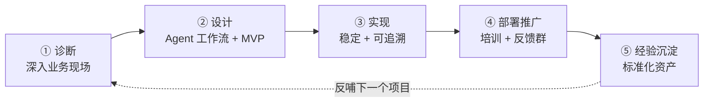
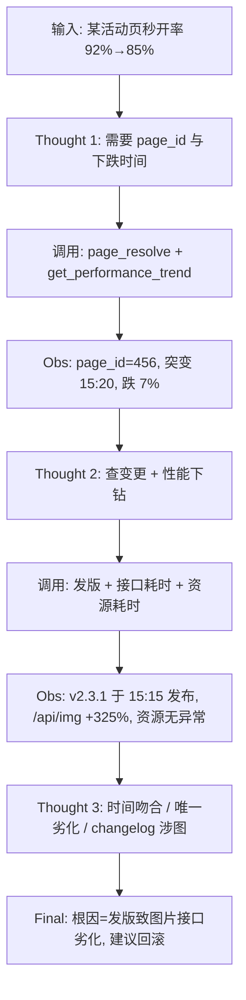

# FDE：把大模型落地为企业确定性生产力

> FDE（Forward Deployed Engineer，向前部署工程师）是连接「大模型能力」与「企业业务价值」的角色。
> 本文整理 FDE 的工作方法论，并以 **Hybrid web 性能自诊项目**（抖音活动页性能智能诊断 Agent）为贯穿案例，说明各阶段如何落地。

---

## 1. FDE 是什么

**一句话定义**：FDE 用工程师的理性拆解业务混沌，用产品经理的共情响应业务痛点，用服务专家的耐心帮助团队过渡，最终把大模型的不确定性，固化成企业流水线上确定性的生产力。

### 1.1 角色定位

FDE 不在实验室调模型，而是**深入业务现场**（车间、供应链、客服中心、研发 on-call），找出「重复、高频、依赖经验」的环节，用 AI 把它变成确定性产能。它源自「向前部署」理念——工程师被推到客户一线，而非坐等需求文档。

### 1.2 与相邻角色的区别

| 角色 | 关注点 | FDE 的差异 |
|---|---|---|
| 算法/模型工程师 | 模型精度、刷 SOTA | FDE 不追求模型最优，追求**业务环节**最优 |
| 产品经理 | 需求与体验 | FDE 还要**亲自实现**并保障稳定性 |
| 解决方案架构师 | 方案与宣讲 | FDE 要**驻场交付**到业务真正用起来 |
| 实施/交付工程师 | 部署上线 | FDE 还负责前置的**痛点诊断**与后置的**资产沉淀** |

> FDE 是「诊断 + 设计 + 实现 + 交付 + 沉淀」的**全链路**角色——这正是它能跨职能拉通的原因。

---

## 2. FDE 工作流总览

五阶段，每阶段都有明确的**产出物与验收标准**，可独立循环验证。



| 阶段 | 目标 | 核心产出 | 验收标准 |
|---|---|---|---|
| ① 诊断 | 找出真能用 AI 解决的痛点 | 《痛点→根因→AI 方案》报告 | 业务方确认痛点真实 |
| ② 设计 | 画清 Agent 工作流，跑通 MVP | 技术 + 业务双可行方案 + MVP | 核心链路 demo 通过 |
| ③ 实现 | 真实场景能跑、可追溯 | 带全链路埋点的初版系统 | 出问题能凭 session-ID 定位根因 |
| ④ 部署推广 | 让业务用起来并离不开 | 操作手册 + 培训 + 反馈群 | 日均调用量、满意度达标 |
| ⑤ 经验沉淀 | 沉淀为可复用资产 | 脚本 / 模板 / Prompt 库 | 下个项目能快速复用 |

---

## 3. 贯穿案例：Hybrid web 性能自诊项目

> 以下案例来自 Hybrid web（抖音活动页）性能智能诊断 Agent 项目，用来说明 FDE 五阶段具体做什么。每个阶段都能对应到 §2 的方法论。

### 项目背景

抖音核心业务线的活动页发版后，监控系统告警：**页面秒开率从 92% 急剧下跌至 85%，跌幅近 7 个百分点**。端侧性能劣化直接影响用户体验与转化率，属于 **P0 级故障**。

传统人工排查要跨**监控平台、发布平台、调用链平台、资源平台**四个系统，分别看趋势图、发版记录、接口耗时、资源加载，再凭经验判断根因。即便熟练工程师也至少 **20–30 分钟**，且每次系统切换都是上下文中断——效率低、易遗漏。随着业务规模增长，这类性能问题频率上升，团队迫切需要自动化、智能化的诊断手段。

这正是 FDE 要识别的「依赖经验、跨系统、耗时」环节——与「排查需要先熟悉整个埋点链路再依赖经验判断，比较耗时」的痛点完全吻合。

### 3.1 诊断：痛点 → 根因 → AI 方案

FDE 深入前端性能 / on-call 现场，观察一次典型故障：**「某活动页秒开率从 92% 跌到 85%」**。

**传统人工排查流程**（跨四个系统反复切换）：

```
监控平台             发布平台              调用链平台            资源平台
看秒开率趋势         查时间点附近的        查接口 P95/P99        查静态资源加载
定位突变时间         发版记录与 changelog   耗时与变化率          耗时与体积变化
```

**痛点 → 根因 → AI 方案**：

| 痛点 | 根因 | AI 方案 |
|---|---|---|
| 要在 4 个平台反复切换 | 数据分散、无统一诊断入口 | 自然语言一句话输入，Agent 自动跨平台拉取 |
| 排查依赖专家经验 | 方法论只在少数人脑子里 | 把 SRE 排查经验固化进 System Prompt |
| 凭人工串联时间/变更/指标 | 多维关联全靠脑力 | 大模型自动做时间关联、变更关联、下钻分析 |
| 20–30 分钟才出结论 | 步骤串行、上下文频繁中断 | ReAct 动态规划，并行调工具，分钟级出报告 |

**产出**：一份《痛点-根因-AI 方案》报告，目标把平均诊断时间从 30 分钟降到 2 分钟以内，且架构可扩展到崩溃率、API 成功率等其他性能场景。

> ⚠️ **关键判断**：FDE 要能分辨「哪些是 AI 能解决的，哪些是**业务流程本身的问题**」。这里不是流程烂，而是「经验没沉淀 + 工具没打通」——属于 AI 能解决的高价值环节；若发现是发布流程缺卡点（如性能门禁缺失），则要先补流程再上 AI。

### 3.2 设计：Agent 工作流 + MVP

采用 **ReAct（Reasoning + Acting）范式**，把大模型推理与工具调用深度融合，四个核心设计：

**① 工具层标准化**——把各平台 API 封装为统一 JSON Schema 工具描述（功能 / 适用场景 / 参数 / 返回值）：

| 工具 | 作用 |
|---|---|
| `get_performance_trend` | 拉取指标趋势，自动识别突变点 |
| `query_release_records` | 查询指定时间点附近的发版记录 |
| `query_trace_metrics` | 获取接口 P95/P99 耗时及变化率 |
| `query_resource_metrics` | 获取静态资源加载耗时与体积变化 |

每个工具精确到「何时用、如何取参、输出何信息」，让 LLM 像查手册一样准确选择。

**② System Prompt 固化排查方法论**——设定 SRE 诊断专家角色，把专家经验提炼为通用方法论：先定位异常时间与幅度 → 再查时间点附近的变更 → 按指标分层下钻（端到端查接口+资源，稳定性查崩溃日志+变更）→ 用时间关联、变化幅度、变更内容一致性锁定根因。

**③ ReAct 动态诊断流程**（秒开率下跌为例）：



全程无硬编码步骤，完全由 LLM 根据工具描述和观察动态决策。

**④ 可扩展性**——为覆盖崩溃率、API 成功率等场景，把 metric 枚举化、扩展工具集（如 `query_crash_logs`），并设计**向量检索辅助**：工具数量膨胀时，每轮 Thought 后用自然语言意图从 Milvus 召回 Top-3 相关工具，只注入这几个详细描述，避免上下文溢出且保持选择精准。

**MVP 原则**：先只跑通「秒开率下跌」这一条核心链路，验证 ReAct + 标准化工具的可行性，再横向扩展到其他指标。

### 3.3 实现：稳定 + 可追溯

技术选型与实现要点：
- **模型**：大模型推理（兼容 OpenAI 接口规范，便于替换）。
- **工具调用**：四个平台 API 按 JSON Schema 标准化，由 Agent 动态选择与并行调用。
- **工具检索**：Milvus 向量库按意图召回 Top-3 工具，解决工具膨胀下的上下文与精度问题。
- **Few-shot 案例库**：相似问题提供参考，形成越用越智能的闭环。
- **可追溯性**（实现阶段的底线，也是这个项目的天然产物）：

> 诊断报告本身就含**证据链**：每一跳 Thought → 工具调用 → Observation 全程留痕，按 session-ID 串联。业务/on-call 问「为什么判定是这个根因」，能逐跳回放——时间吻合、`/api/img` 耗时 +325%、changelog 涉及图片加载，证据闭环。

确定性不只来自模型，更来自**可解释、可回溯**——对 P0 故障场景尤其关键，on-call 工程师敢不敢采信 Agent 的结论，全看证据链是否扎实。

### 3.4 部署推广：让业务离不开

Agent 上线后接入 on-call 流程：

- 写**使用手册**、对 on-call 工程师做**培训**；
- 建立**反馈群**，收集误判 / 漏判案例反哺案例库；
- 用指标评估效果：**诊断时效（30min → 90s）、根因 Top1 准确率（92%）、覆盖指标数（6 类）、是否先于人工定位**。

> 多次在凌晨故障中**先于人工 20 分钟**给出准确诊断——到这一步，on-call 工程师真正离不开它了，产品才算扎下了根。

### 3.5 经验沉淀：标准化资产

把项目里可复用的部分抽象成资产，供下一个场景快速启动：

- **标准化工具描述模板**（JSON Schema：功能 / 场景 / 参数 / 返回值）；
- **ReAct 诊断骨架**（Thought-Action-Observation 循环 + 工具检索）；
- **SRE 方法论 Prompt 模板**（定位 → 查变更 → 分层下钻 → 锁定根因）；
- **向量检索工具召回机制**（Milvus Top-3，解上下文溢出）；
- **Few-shot 案例库**（典型故障的参考样本）。

这套资产后来成为**全栈 Copilot** 的基础——同一个「标准化工具 + ReAct + 方法论 Prompt」骨架，换个工具集就能服务新场景。

---

## 4. FDE 能力矩阵

| 能力 | 要会做什么 | 产出物 |
|---|---|---|
| **诊断** | 深入业务现场（如前端/on-call 团队），观察日常工作流，识别重复/高频/依赖经验的环节；判断哪些可用 AI、哪些是流程问题 | 《痛点→根因→AI 方案》报告 |
| **设计** | 画 Agent 工作流（输入 / 流程 / 工具 / 文档 / 输出 / 验收）；兼顾技术与业务可行性；先做 MVP | 双可行方案 + MVP |
| **实现** | 亲自实现 Agent（调 LLM、调工具、RAG 等）；保障稳定性与可追溯（session-ID 全链路埋点） | 真实场景可跑、有数据反馈的初版 |
| **部署推广** | 写操作手册、培训、建反馈群；跟踪调用量/满意度/时效 | 业务日均调用量、满意度、反馈 |
| **经验沉淀** | 将项目、脚本、可复用代码沉淀为标准化资产；建立反馈机制 | 可复用资产库 |

---

## 5. 两条容易踩的线

1. **别用 AI 给烂流程加速。** 诊断阶段若发现是流程本身的问题（发布缺性能门禁、审批冗余、系统割裂），先推动流程梳理，再上 AI。
2. **别只追求「能跑」。** 企业场景的底线是**可追溯**——没有 session-ID 级的证据链/埋点，业务一旦质疑结论，FDE 就无法自证，项目会迅速失去信任。

---

> FDE 的价值不在「会用大模型」，而在**把大模型的不确定性，变成企业流水线上一道道确定性的工序**。Hybrid web 性能自诊项目就是缩影：从人工跨 4 系统排查 30 分钟、凭经验判断，到 Agent 90 秒输出带证据链的诊断、Top1 准确率 92%、先于人工 20 分钟定位故障。
