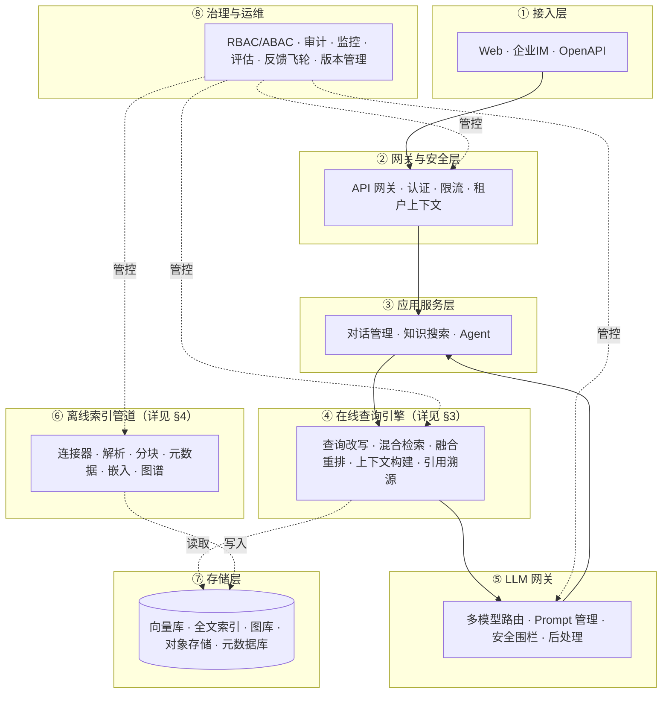
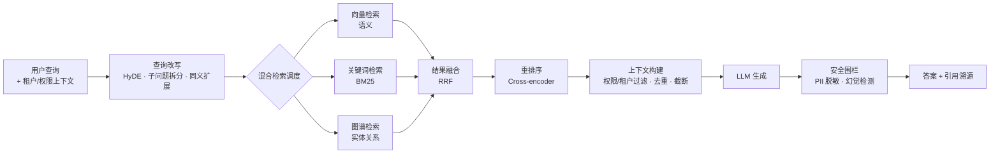
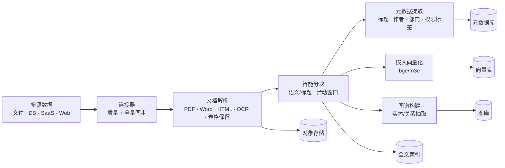
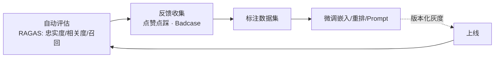

# 企业级 RAG 知识库架构设计文档

> 范围：企业内部知识库问答系统的整体架构、关键数据流、技术选型与非功能性设计。

---

## 1. 设计目标与原则

### 1.1 业务目标

构建一个可服务于**多部门 / 多租户**的企业知识问答系统：用户用自然语言提问，系统从企业异构知识源中检索最相关的片段，交由 LLM 生成**带引用溯源、可审计、权限受控**的答案。

### 1.2 设计原则

| 原则 | 含义 |
|---|---|
| **原文不丢、过程可溯** | 原始文档永不修改，检索/生成只是衍生视图；每段答案都能回链到原文 |
| **检索为先** | RAG 的质量上限由召回决定，重投入在分块、混合检索、重排，而非一味堆模型 |
| **多租户硬隔离** | 从网关到存储全程携带租户/权限上下文，数据层物理或逻辑隔离，杜绝串数 |
| **离线/在线解耦** | 索引管道与查询引擎分离，互不阻塞，各自弹性扩缩 |
| **可评估、可演进** | 评估-反馈-微调飞轮，配置与模型版本化，支持灰度与回滚 |
| **成本可控** | 缓存、模型分级路由、向量库压缩，避免 LLM 与存储成本失控 |

### 1.3 非功能性目标（示例基线）

- **查询延迟**：P95 端到端 < 3s（含 LLM 首字），检索 P95 < 500ms
- **可用性**：核心查询链路 99.9%，离线管道故障不影响在线
- **安全**：传输加密、PII 脱敏、文档级权限、完整审计
- **扩展**：查询引擎、LLM 网关、向量库均可水平扩展

---

## 2. 架构总览

系统分为 **8 层**。在线查询链路（接入 → 网关 → 应用 → 查询引擎 → LLM 网关）与离线索引管道（数据源 → 索引管道 → 存储）共享存储层，受治理运维层统一管控。

### 2.1 分层总览图

> 说明：上图刻意只画主干边，突出**分层与职责边界**；每层内部的逐环节数据流在 §3、§4 用独立图展开。

### 2.2 两类核心数据流

| 数据流 | 方向 | 触发 | 详见 |
|---|---|---|---|
| **在线查询** | 用户 → 系统 → 用户 | 每次提问 | §3 |
| **离线索引** | 数据源 → 存储 | 定时/事件同步 | §4 |

---

## 3. 在线查询链路（RAG 核心）

这是决定回答质量的**主战场**。一次查询的端到端流程如下。

### 3.1 查询数据流图

### 3.2 环节详解

- **查询改写（Query Rewriting）**：原始 query 往往口语化、信息不足。用 LLM 或规则做 **HyDE**（先让模型生成假设答案再检索）、**子问题拆分**（复杂问题分解）、**同义/多语言扩展**，显著提升召回率。改写后保留原始 query 用于精排对照。
- **混合检索调度**：并行召回三路，互补短板——
  - **向量检索**：语义相似，擅长模糊意图；弱于精确实体、数字、代码。
  - **关键词检索（BM25）**：精确匹配，弥补向量对专有名词/编号的遗漏。
  - **图谱检索（GraphRAG）**：沿实体关系跳转，回答「A 的负责人参与过哪些 B 类项目」这类多跳关联。
- **结果融合（RRF）**：三路结果用 **Reciprocal Rank Fusion** 合并，避免不同打分体系不可比的问题。
- **重排序（Rerank）**：粗排后用 **Cross-encoder**（如 bge-reranker）对 Top-K 候选逐对打分，把真正相关的片段提到最前——这是性价比最高的质量提升手段。
- **上下文构建**：对片段做**租户/权限过滤**（剔除当前用户无权访问的）、去重、按 token 预算截断，组装进 Prompt。
- **引用溯源**：为答案中的论断标注来源片段 ID，前端渲染成可点击的原文链接，是「企业可信」的关键。
- **安全围栏**：对输出做 PII 脱敏、敏感词检测、幻觉/越界检测（如「我不知道」兜底）。

> 全程携带租户与权限上下文：检索 query 带租户过滤、上下文构建再做权限过滤，**双重保障**防越权。

---

## 4. 离线索引管道

数据处理的**生命线**——索引质量决定检索上限。一篇文档从接入到可检索的流程如下。

### 4.1 索引数据流图

### 4.2 环节详解

- **连接器**：对接文件系统、数据库、Confluence/SharePoint、网页爬虫等，支持**增量同步**（按更新时间/变更日志）与全量重建。通过消息队列解耦，扛住突发批量入库。
- **文档解析**：统一处理 PDF/Word/Markdown/图片（OCR），**关键在于保留表格、标题层级、列表结构**——丢结构等于丢语义。版面分析（layout）对复杂 PDF 尤为重要。
- **智能分块**：最影响检索质量的环节。按标题/段落**语义分块**为主，滑动窗口为辅；块大小通常 256–1024 token，相邻块保留重叠（overlap）防截断。可加「父子分块」（小块检索、大块回填上下文）。
- **元数据提取**：自动识别标题、作者、时间、部门、密级等，**用于检索过滤**（如「只搜某部门近 30 天文档」）。
- **嵌入向量化**：用中文友好模型（bge-large-zh、m3e）将分块编码为向量。嵌入模型升级需**全量重算**，故其版本管理格外重要。
- **图谱构建（可选）**：对长文档/跨文档做实体识别与关系抽取，构建企业知识图谱，支撑 GraphRAG。

> 管道输出均为**幂等**：同一文档重新入库覆盖旧版本，分块/向量/图谱一致性由文档版本号保证。

---

## 5. 存储层设计

五类存储各司其职，按读写特征选型。

| 存储 | 职责 | 推荐选型 | 读写特征 |
|---|---|---|---|
| **向量库** | 语义检索（ANN）+ 标量过滤 | Milvus（大规模）/ Qdrant（轻量） | 读密集、批量写 |
| **全文索引** | 关键词检索（BM25）、复杂过滤 | Elasticsearch / OpenSearch | 读写均衡 |
| **图库** | 实体关系遍历（GraphRAG） | Neo4j | 读为主、低频写 |
| **对象存储** | 原始文档、解析富文本（高亮/下载） | MinIO（私有化）/ S3 | 写一次、偶尔读 |
| **元数据库** | 文档/分块元数据、租户、权限、配置 | PostgreSQL | 事务型读写 |

设计要点：
- 向量库、全文索引、图库均**支持按租户/权限字段过滤**，配合 §3 的双重过滤。
- 分块内容与其向量**分离存储**：向量在向量库，原文片段在元数据库或对象存储，按 ID 关联——便于重建索引而不动原文。

---

## 6. LLM 网关与生成

把「调用 LLM」收敛为一层网关，屏蔽多模型差异，统一治理。

- **多模型路由**：抽象 GPT-4 / Claude / 私有化 Llama3 等，按场景路由（简单问答走小模型省钱、复杂推理走大模型），支持负载均衡与故障转移。
- **Prompt 管理**：集中、版本化管理 System Prompt 与 Few-shot，支持按租户/场景动态拼装，A/B 测试。
- **安全围栏**：输入侧（注入防护）+ 输出侧（PII 脱敏、敏感词、幻觉检测、引用校验）。
- **后处理**：格式美化、引用脚注注入、流式输出（SSE，详见 [sse-vs-websocket.md](sse-vs-websocket.md)）。

---

## 7. 企业治理与运维

### 7.1 多租户与权限

- **租户隔离**：网关注入租户上下文，贯穿检索与存储；向量库可用 partition 或 collection 隔离。
- **权限模型**：RBAC（角色）+ ABAC（属性）+ **文档级权限**（DCL）。检索结果在上下文构建阶段按用户可见范围二次过滤，即使向量召回也不可见。

### 7.2 可观测性

- **指标**：Prometheus + Grafana 监控各服务延迟、吞吐、召回数、LLM 成功/失败率、token 消耗。
- **链路追踪**：一次查询串联改写→检索→重排→生成全链路，便于定位质量瓶颈。
- **审计**：记录每次查询、生成、文档下载，满足合规。

### 7.3 评估与反馈飞轮

- 自动评估用 **RAGAS** 等指标（faithfulness、answer relevancy、context recall）持续打分。
- 用户反馈（点踩、改写）沉淀为 Badcase，反哺分块策略、嵌入/重排模型、Prompt 的迭代，形成质量飞轮。

---

## 8. 技术选型矩阵

> 下列为常见组合，**选型应优先团队能力与运维成本**，而非追逐最新组件。

| 能力 | 候选 | 推荐（通用） | 理由 |
|---|---|---|---|
| 向量库 | Milvus / Qdrant / Weaviate / pgvector | **Milvus**（大体量）/ **pgvector**（已用 PG、量小） | Milvus 扩展性强；pgvector 减少组件数 |
| 全文索引 | Elasticsearch / OpenSearch / Vespa | **Elasticsearch** | 生态成熟、BM25 稳定 |
| 图库 | Neo4j / NebulaGraph | **Neo4j** | GraphRAG 场景足够、易上手 |
| 嵌入模型 | bge-large-zh / m3e / OpenAI text-embedding | **bge-large-zh** | 中文效果好、可私有化 |
| 重排模型 | bge-reranker / Cohere rerank | **bge-reranker** | 开源、效果稳定 |
| LLM | GPT-4o / Claude / Qwen / Llama3 | 视合规而定 | 敏感数据选私有化 Qwen/Llama3 |
| 框架 | LangChain / LlamaIndex / 自研 | **LlamaIndex**（检索强）/ 自研编排 | LlamaIndex 检索原语全；自研可控性高 |
| 消息队列 | Kafka / Redis Streams / RabbitMQ | **Kafka**（大体量）/ **Redis**（轻量） | 解耦离线管道 |

---

## 9. 部署拓扑（要点）

- **私有化部署**：敏感数据不出企业网络，LLM 用本地推理（vLLM 部署开源模型），对象存储用 MinIO。
- **混合部署**：检索与存储私有化，LLM 走 API 网关调用商用模型（经脱敏后）。
- **核心无状态服务**（网关、查询引擎、LLM 网关）多副本水平扩展；**有状态存储**（向量库、PG）独立集群。
- 离线管道与在线服务**物理隔离**，管道高峰不影响查询 P95。

---

## 10. 演进路线

| 阶段 | 目标 | 关键能力 |
|---|---|---|
| **MVP** | 跑通单租户问答 | 单路向量检索 + LLM + 基础引用 |
| **进阶** | 提质量、可商用 | 混合检索 + 重排 + Prompt 管理 + 基础评估 |
| **企业级** | 多租户、合规、可演进 | 文档级权限 + 安全围栏 + 评估飞轮 + 版本化 + 图谱检索 |

> 建议：**先把检索质量做到位再堆功能**。很多团队急于上 Agent/图谱，却败在分块与重排没调好——召回不行，再强的 LLM 也编不出好答案。

---

## 附录：关键设计取舍速查

| 取舍 | 推荐 | 理由 |
|---|---|---|
| 单路 vs 混合检索 | 混合（向量+BM25） | 互补，召回上限更高 |
| 是否上 GraphRAG | 看场景 | 多跳关联强需求才上，否则徒增复杂度 |
| 嵌入/重排分开 vs 一体 | 分开 | 各自可独立升级、替换 |
| 流式输出协议 | SSE | LLM 单向流式的事实标准，详见 [sse-vs-websocket.md](sse-vs-websocket.md) |
| 自研 vs 框架 | 编排自研 + 原语用库 | 核心链路可控，避免被框架黑盒拖累 |
